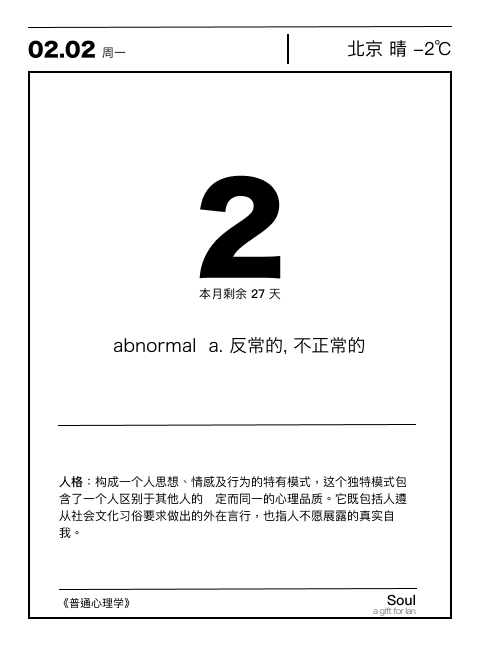
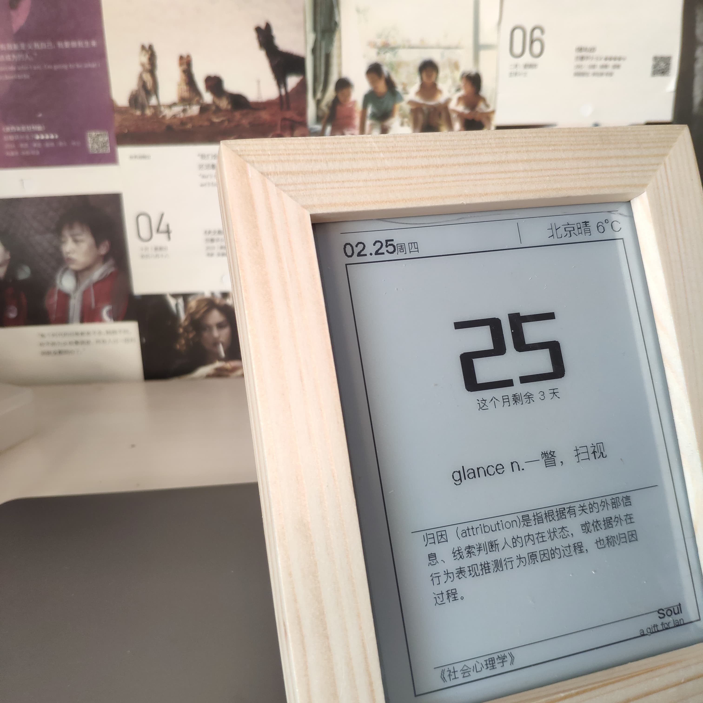

# Soul
> A gift for lan❤️

Soul 是一个电子日历产品，灵感来源于单向历（参考 UI 设计），代码参考网络，该产品是为了帮助 lan 考上研究生准备哒！ Go！Go！Go！除了日历功能外，每天可以随机展示考研英语词汇，帮助记忆，同时有心理学知识点复习。其他功能暂时不需要啦！

当然可以扩展使用其他数据集，比如现代诗、古代史、名言呀等等。

soulapi: https://soul.chaojie.fun/docs
### 功能
- [X] 时间展示
- [X] 天气展示
- [X] 当月剩余天数
- [X] 随机考研英语高频词汇
- [x] 随机心理学考点
### UI 效果

### 成品效果

### WHO IS "Lan"
My Girlfriend！Of course!

### TODO
- [ ] 修复单词显示过长问题
